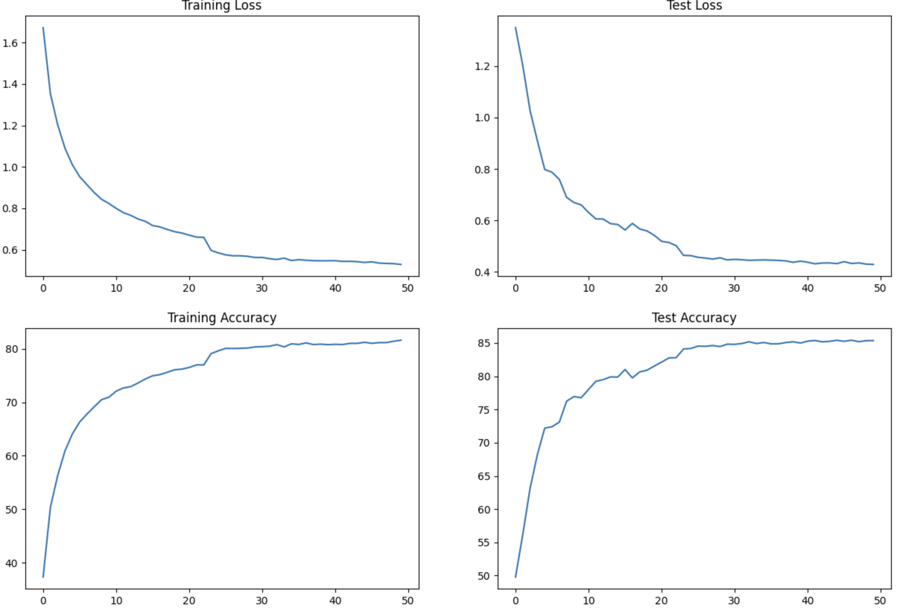

# Convolutional Neural Network For Cifar10 Dataset

## Usage
This repo has a Convolutional Neural Network, That is designed for training the Model over Cifar10 dataset.

### model.py
You will find the model definations, Training and Testing methods inside the model.py file.

#### Summary
Below is the summary of the model.

----------------------------------------------------------------
        Layer (type)               Output Shape         Param #

================================================================

            Conv2d-1           [-1, 32, 32, 32]             896
              ReLU-2           [-1, 32, 32, 32]               0
       BatchNorm2d-3           [-1, 32, 32, 32]              64
           Dropout-4           [-1, 32, 32, 32]               0
            Conv2d-5           [-1, 64, 32, 32]          18,496
              ReLU-6           [-1, 64, 32, 32]               0
       BatchNorm2d-7           [-1, 64, 32, 32]             128
           Dropout-8           [-1, 64, 32, 32]               0
            Conv2d-9           [-1, 32, 16, 16]          18,464
           Conv2d-10           [-1, 32, 16, 16]           9,248
             ReLU-11           [-1, 32, 16, 16]               0
      BatchNorm2d-12           [-1, 32, 16, 16]              64
          Dropout-13           [-1, 32, 16, 16]               0
           Conv2d-14           [-1, 64, 16, 16]          18,496
             ReLU-15           [-1, 64, 16, 16]               0
      BatchNorm2d-16           [-1, 64, 16, 16]             128
          Dropout-17           [-1, 64, 16, 16]               0
           Conv2d-18             [-1, 32, 7, 7]          18,464
           Conv2d-19             [-1, 32, 7, 7]           9,248
             ReLU-20             [-1, 32, 7, 7]               0
      BatchNorm2d-21             [-1, 32, 7, 7]              64
          Dropout-22             [-1, 32, 7, 7]               0
           Conv2d-23             [-1, 32, 7, 7]             320
           Conv2d-24             [-1, 64, 7, 7]           2,112
             ReLU-25             [-1, 64, 7, 7]               0
      BatchNorm2d-26             [-1, 64, 7, 7]             128
          Dropout-27             [-1, 64, 7, 7]               0
           Conv2d-28             [-1, 32, 3, 3]          18,464
           Conv2d-29             [-1, 32, 3, 3]           9,248
             ReLU-30             [-1, 32, 3, 3]               0
      BatchNorm2d-31             [-1, 32, 3, 3]              64
          Dropout-32             [-1, 32, 3, 3]               0
           Conv2d-33             [-1, 64, 3, 3]          18,496
             ReLU-34             [-1, 64, 3, 3]               0
      BatchNorm2d-35             [-1, 64, 3, 3]             128
          Dropout-36             [-1, 64, 3, 3]               0
           Conv2d-37             [-1, 64, 3, 3]          36,928
      AdaptiveAvgPool2d-38       [-1, 64, 1, 1]               0           
           Conv2d-39             [-1, 10, 1, 1]             650

================================================================

Total params: 180,298

Trainable params: 180,298

Non-trainable params: 0

----------------------------------------------------------------

Input size (MB): 0.01

Forward/backward pass size (MB): 4.01

Params size (MB): 0.69

Estimated Total Size (MB): 4.71

----------------------------------------------------------------

Model has 4 blocks each block consist 3 Convolution Layers. Last layer of each block is used as a transition layer to diminish the number of channels, The transition layer is a strided and dilated convolution layer. In block 2 a depthwise seperable convolution layer is used. Parameters are kept below 200k as per assignment instructions.

----------------------------------------------------------------

***

### S9.ipynb

S9.ipynb is the notebook where the model training is executed by importing all the dependencies required, from loading and transfroming data till training and measuring model performance.

***
## Model Performance
Model performance for Cifar10 Model based on the model architecture mentioned above in summary are as follows:

Batch normalization is used as a normalization technique.
Model is trained over 50 epochs, with SGD as optimizer and stepLR with step size of 23.

Train Accuracy : 81.62

Test Accuracy : 85.47

## Graphs of Losses and accuracy of the Cifar10 model with Batch Normalization:

